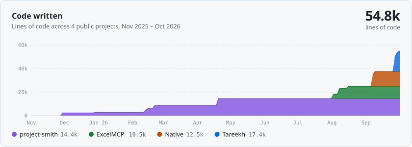
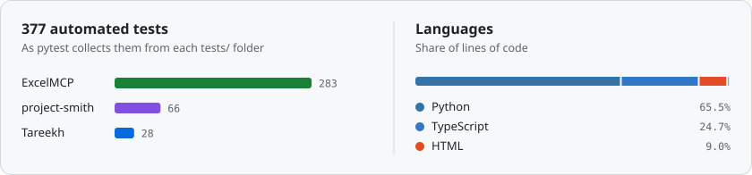

# Karunya Muddana

I'm a second-year Computer Science (AI/ML) student at GITAM in Hyderabad, with a CGPA of 9.15. I build LLM agents that call tools and work with real data, and I try to make every answer traceable to the file, page or cell it came from.

I've been freelancing since 2024. The first agent I built let a company's staff ask plain-English questions of their Excel workbooks, and each answer pointed to the sheet and cell it came from. They used it until the company moved to a commercial ERP.

I'm looking for an AI/ML engineering internship. You can email me at [karunya.muddana@outlook.com](mailto:karunya.muddana@outlook.com), find me on [LinkedIn](https://www.linkedin.com/in/karunya-muddana), or see more on [my portfolio](https://karunya-muddana.github.io).

## Projects

  <a href="https://github.com/Karunya-Muddana/tareekh"><picture><source media="(prefers-color-scheme: dark)" srcset="assets/card-tareekh-dark.svg"></picture></a>
  <a href="https://github.com/Karunya-Muddana/ExcelMCP"><picture><source media="(prefers-color-scheme: dark)" srcset="assets/card-excelmcp-dark.svg"></picture></a>

  <a href="https://github.com/Karunya-Muddana/Native"><picture><source media="(prefers-color-scheme: dark)" srcset="assets/card-native-dark.svg"></picture></a>
  <a href="https://github.com/Karunya-Muddana/project-smith"><picture><source media="(prefers-color-scheme: dark)" srcset="assets/card-smith-dark.svg"></picture></a>

I led the Tareekh team at Hack with Hyderabad 3.0. I also benchmarked 11 models for Ames house-price prediction, where a tuned XGBoost reached 0.1002 log-RMSE.

## Code

<picture><source media="(prefers-color-scheme: dark)" srcset="assets/graph-growth-dark.svg"></picture>

<picture><source media="(prefers-color-scheme: dark)" srcset="assets/graph-tests-languages-dark.svg"></picture>

These are counted from the four public repos and rebuilt every Monday by [a GitHub Action](.github/workflows/refresh.yml).

## Tools I use

Python, SQL, TypeScript and C++. For AI work: MCP, LangGraph, RAG and embeddings, scikit-learn, XGBoost, Pandas and NumPy. For backends: FastAPI, PostgreSQL on Supabase, SQLite, the Microsoft Graph API and pytest. I deploy on Google Cloud and Vertex AI, with Docker.
