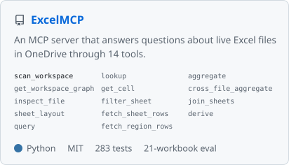
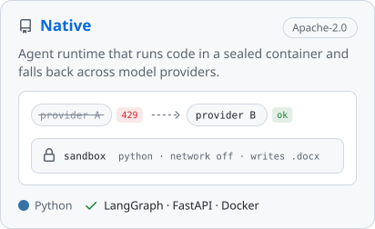
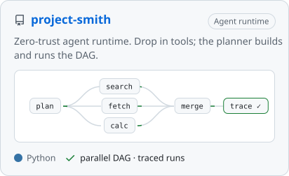
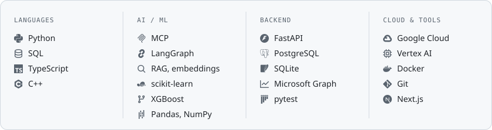

<picture><source media="(prefers-color-scheme: dark)" srcset="assets/header-dark.svg"></picture>

  <a href="https://karunya-muddana.github.io"><picture><source media="(prefers-color-scheme: dark)" srcset="assets/btn-portfolio-dark.svg"></picture></a>
  <a href="https://www.linkedin.com/in/karunya-muddana"><picture><source media="(prefers-color-scheme: dark)" srcset="assets/btn-linkedin-dark.svg"></picture></a>
  <a href="mailto:karunya.muddana@outlook.com"><picture><source media="(prefers-color-scheme: dark)" srcset="assets/btn-email-dark.svg"></picture></a>

<picture><source media="(prefers-color-scheme: dark)" srcset="assets/facts-dark.svg"></picture>

The first agent I shipped was for a company: staff asked plain-English questions of their Excel workbooks and every answer came back traced to the file, sheet and cell. They used it daily until the company moved to a commercial ERP. Everything I've built since follows the same rule: **if an agent says it, it should be able to show where it came from.**

### Selected work

  <a href="https://github.com/Karunya-Muddana/tareekh"><picture><source media="(prefers-color-scheme: dark)" srcset="assets/card-tareekh-dark.svg"></picture></a>
  <a href="https://github.com/Karunya-Muddana/ExcelMCP"><picture><source media="(prefers-color-scheme: dark)" srcset="assets/card-excelmcp-dark.svg"></picture></a>

  <a href="https://github.com/Karunya-Muddana/Native"><picture><source media="(prefers-color-scheme: dark)" srcset="assets/card-native-dark.svg"></picture></a>
  <a href="https://github.com/Karunya-Muddana/project-smith"><picture><source media="(prefers-color-scheme: dark)" srcset="assets/card-smith-dark.svg"></picture></a>

### Stack

<picture><source media="(prefers-color-scheme: dark)" srcset="assets/stack-dark.svg"></picture>
